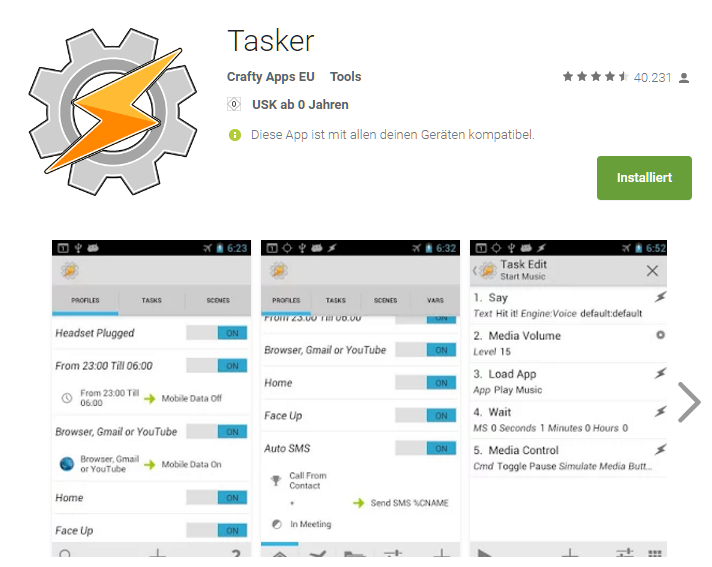

# Tasker Setup Guide
[project]: https://raw.githubusercontent.com/bstrebel/pimatic-phone/master/assets/Pimatic.prj.xml

Experienced users may just download and import the [example project][project]
as a starting point and change the url and device name in the _HTTP Get_ action.

If you start from scratch with Tasker on Android, the following guide will be helpful.

Download and install [Tasker](https://play.google.com/store/apps/details?id=net.dinglisch.android.taskerm&hl=de) from Google Play:

The project toolbar is visible in the advanced mode. First goto preferences

and disable Beginner mode:

